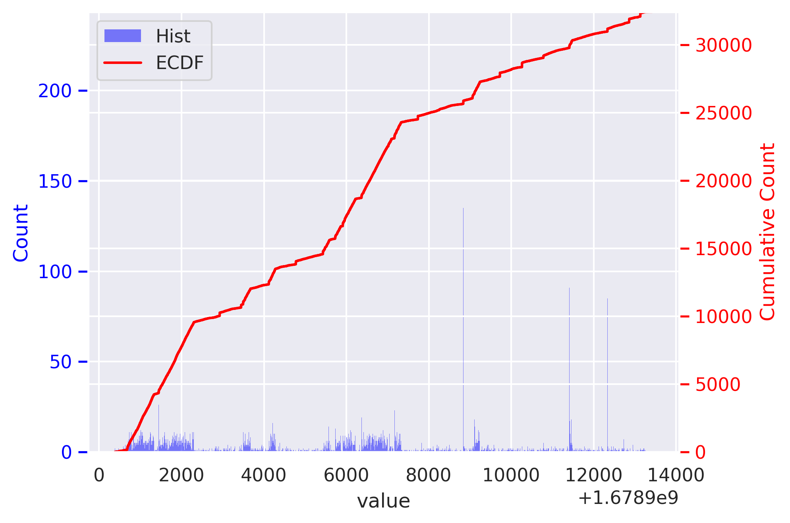

# The ceased blocking of the dynamic blocking of fully encrypted traffic since March 2023

On Wednesday March 15, 2023, anonymous USENIX SECURITY'23 artifact evaluation reviewers reported to us that they couldn't observe the dynamic blocking of fully encrypted traffic anymore.

From the same day, we conducted further experiments and can confirm that the GFW has stopped dynamically blocking fully encrypted traffic sometime between Tuesday March 7, 2023 (the last time we tested) and Wednesday March 15, 2023 (AE reviewers' test).

Below we discuss the possible reasons of this unblocking, and show evidence that the blocking has stopped. We have included all experiments code and data discussed below under this `ceased-dynamic-blocking` directory.

## Possible reasons

It may be because the politically sensitive time has passed and the censor is thus less willing to tolerate the collateral damage. Specifically, there were two politically sensitive conferences in China ended on Monday March 13, 2023:

* https://en.wikipedia.org/wiki/2023_National_People's_Congress
* https://zh.wikipedia.org/wiki/中国人民政治协商会议第十四届全国委员会#第一次会议

## Confirm ceased blocking

### User reports

On March 17, 2023, two users in China also reported that their Shadowsocks and VMess servers have not been blocked anymore:

* https://github.com/net4people/bbs/issues/129#issuecomment-1472914217 "But accidently, ss+tcp/udp and vmess+tcp are reusable at now."
* https://github.com/net4people/bbs/issues/129#issuecomment-1474179488 "I can also confirm that this is the case. My experiment on the gfw-report fork of Shadowsocks vs regular AEAD Shadowsocks has failed miserably because neither got blocked even with very large & consistent downloading traffic."

### Re-testing by Internet scanning

On March 15, 2023, we performed Internet scan from a VPS machine in Tencent Cloud Beijing to all 142,827 IP addresses that were previously marked affected as of August 22, 2022.

Specifically, for each IP address, we tested it with two types of probes: 50-bytes of random data and 50-bytes of zero (as the control group). For each type of probes, we made up to 25 connections, and when five consecutive connections to an IP address failed we mark it as possibly affected. We then removed any probes that were also marked as affected from the control group to rule out most of the false positives due to network failure rather than censorship.

```sh
cat retesting-2023-03-15.sh
```

```sh
#!/bin/bash

# grep true 10pct-80-9machines-t5-r25-w500-s1s.aggregated.out > 2022-08-22-10pct-80-9machines-t5-r25-w500-s1s.aggregated.affected.out

# scan with 50-byte random probes
cut -d, -f2 2022-08-22-10pct-80-9machines-t5-r25-w500-s1s.aggregated.affected.out | cut -d\: -f1 | ./affected-norand -p 80 -worker 500 | tee retesting-on-2023-03-15-random-all-affected-ip-as-2022-08-22-10pct-80-1machine-t5-r25-w500-s1s.out

# scan with 50-byte zero probes
cut -d, -f2 2022-08-22-10pct-80-9machines-t5-r25-w500-s1s.aggregated.affected.out | cut -d\: -f1 | ./affected-norand -p 80 -worker 500 -payload 0000000000000000000000000000000000000000000000000000000000000000000000000000000000000000000000000000 | tee retesting-on-2023-03-15-zero-all-affected-ip-as-2022-08-22-10pct-80-1machine-t5-r25-w500-s1s.out
```

We then compare the results between these two experiments to find the IP addresses that are marked as blocked (`true`) in the random probe test but marked as not blocked (`false`) in the zero probe test.

```sh
./compare.py --random retesting-on-2023-03-15-random-all-affected-ip-as-2022-08-22-10pct-80-1machine-t5-r25-w500-s1s.out --zero retesting-on-2023-03-15-zero-all-affected-ip-as-2022-08-22-10pct-80-1machine-t5-r25-w500-s1s.out 2>/dev/null | grep "true;false" | cut -d\; -f1 | cut -d\: -f1 > appear_blocked.txt
```

In total, there were `5371` IP addresses (out of the 142,827 tested IPs) that satisfy these conditions:

```sh
wc -l appear_blocked.txt
5371
```

We don't know if the censor temporarily enabled the blocking again during our test. The figure `cdf-blocked-timing.png` shows the number of tests blocked across time during our test:

```sh
grep true retesting-on-2023-03-15-random-all-affected-ip-as-2022-08-22-10pct-80-1machine-t5-r25-w500-s1s.out | cut -d, -f1 | cdf.py -o cdf-blocked-timing.png
```




We then retested these IP addresses by sending 50-bytes random probes to it, and confirmed they are not blocked by the GFW's dynamic blocking:

```sh
cat appear_blocked.txt | ./affected-norand --worker 100 | tee appear_blocked_results.csv
```

```sh
grep -c false appear_blocked_results.csv
```
```txt
4358
```

```sh
grep -c true appear_blocked_results.csv
```
```txt
440
```


### Rule out other factors that cause failure in observation

As described in the paper, our detection tool `utils/affected-norand` relies on residual censorship to detect blocking. We thus conduct experiments to confirm that the GFW indeed stopped blocking, not because the GFW stopped doing residual censorship and our tools failed consequently.

Specifically, within the same connection, we first send 200 bytes of random payload, then wait for three seconds, and then send eight bytes of "a". If the blocking is happening on per-connection basis, we would have not received any bytes after the 200 bytes of random payload; however, as shown in the output below, the server indeed received all 208 bytes we sent:

Client (China TencentCloud Beijing):

```txt
ubuntu@VM-0-14-ubuntu:~$ (head -c200 /dev/urandom; sleep 3; echo -n aaaaaaaa) | nc -vn REDACTED_US_SERVER_IP 12345
Connection to REDACTED_US_SERVER_IP 12345 port [tcp/*] succeeded!
^C
```

Sink server (US DigitalOcean SFO):

```txt
2023/03/15 16:13:11 Close: REDACTED_US_SERVER_IP <-- REDACTED_CN_SERVER_IP:40118, by client after 6.975661792 seconds. Received 208 bytes in total

1678896784083,REDACTED_US_SERVER_IP,12345,REDACTED_CN_SERVER_IP,40118,b1fe461a0d6f5a349eeb7dbe2c9ea0b2c694234ce8653fb61c60541917e335a37be79a72b07c8f3a3db04db28ee105ad13d60e035007558d30543243a63f7e1d4af2c6fd5337b54778598e16c7f70f70175fcee9c15556e12dae1cbb9c8e4a0398b79c853cb56d58e729928bda84275d1101594a6c6fad9ba5478da51449bfba6d79c0fa45f8e9ebda867eaa532c849c9bdcdbe54903cf4402a3db695b23fe0b554eb122acbaea66d446946ea656194cd121997394786e4e8ae47aca5e0aadb61bb57865a6f5a5866161616161616161,208,6.976
```

## Other notes

Note that we can only confirm that the **dynamic blocking** of fully encrypted traffic, which is what we studied in this paper, has been stopped. We do not know if the **static blocking** of fully encrypted servers continues or not. There have been two blocking strategies being employed to block fully encrypted traffic, which work in parallel: a dynamic one that blocks fully encrypted traffic immediately after seeing a fully encrypted payload, but only blocks the connections temporarily for 180 seconds; a static one that blocks the IP addresses of circumvention servers with a delay of a few days or weeks but lasts more than a few weeks.
